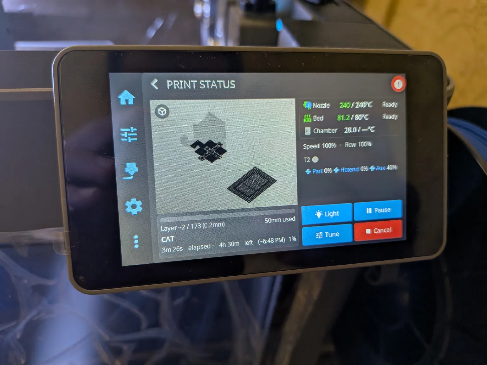
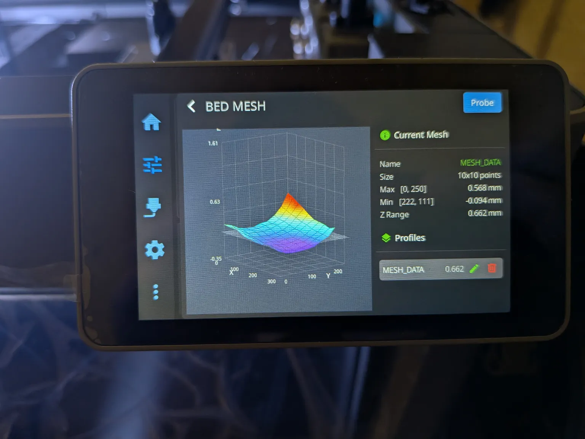

# creator5-custom-firmware

Custom firmware for the FlashForge **Creator 5** and **Creator 5 Pro**.

It installs the way a normal FlashForge update does: copy one file to a USB
stick, plug it in, power the printer on. No jailbreak, no soldering, no
opening the case, no ssh needed to get started — the printer's own updater
does the work.

Packages are published on the
[Releases page](https://github.com/Klipper4FlashForge/firmware/releases) —
two files per release, one per model, marked *pre-release* while the mod is
young.

> **Unofficial and unaffiliated with FlashForge.** It voids your warranty and
> you are responsible for your machine. See [Status](#status) for what has
> actually been tried on hardware before you flash anything.

---

## Status

**It runs on a real printer** — a Creator 5 Pro, flashed and printing:

 

A checked box happened on that machine; an empty one has not, yet.

- [x] **Install and migration from stock firmware** — the printer's own
  updater does it, and your unit's factory calibration imports itself on the
  first boot
- [x] **Printing** — gcode straight from the slicer, nothing edited
- [x] **Toolchanges** — a current Klipper with real toolchanger support, in
  place of the 0.12-era tree FlashForge ships
- [x] **Nozzle-offset calibration**
- [x] **Mainsail** at `http://<printer-ip>/`, with a current Moonraker behind
  it — anything that speaks the Klipper API works (FlashForge's 2022 build is
  too old for today's Mainsail to even show the camera panel)
- [x] **Camera** — mjpg-streamer was already on the printer, unused; this
  firmware simply starts it
- [x] **Wifi**
- [x] **HelixScreen** on the printer's own screen
- [x] **ssh as root** — a random password is chosen on the **first** install
  and written to `anvil-password.txt` on your stick; updates keep it, and
  nothing crackable ships in the package (`make passwd` bakes in your own)
- [ ] **Chamber heater**
- [ ] **Creator 5 (non-Pro)** — its package builds and passes the same
  replica test suite, but has not touched hardware
- [ ] **Going back to stock** — proven on the printer replica
  (`make test-recovery`), not yet needed on the machine. Flashing the stock
  package restores everything it carries; Moonraker is not in it — it ships
  only on the factory image — so the mod's build stays, and keeps working;
  see [If something goes wrong](#if-something-goes-wrong)

Have the stock package for your model on a spare stick before you begin.

How the mod hooks in — one file, `firmwareExe`, with the stock boot scripts,
updater and recovery path left untouched — is
[docs/how-it-works.md](docs/how-it-works.md).

### What you give up

That one file is FlashForge's whole application, so anything that lived inside
it rather than in a separate service goes with it:

* **The FlashForge network API on `:8898`**, and with it FlashPrint, Orca's
  FlashForge profile and the mobile app. Moonraker's API takes over, which is
  what Mainsail, OrcaSlicer's Klipper/Moonraker upload and Fluidd speak.
  Slice for the toolchanger and send it there instead.

The camera is **not** on that list, though the app did serve it: mjpg-streamer
is already on the printer, unused, and this firmware simply starts it. The
stream shows up in Mainsail as usual.

Flashing the stock package brings the API back.

---

## Which file do I need

**Creator 5 and Creator 5 Pro are not interchangeable.** Each package is built
for one model and the printer refuses a package meant for the other, so pick
the file whose name matches your machine on the
[Releases page](https://github.com/Klipper4FlashForge/firmware/releases):

| Your printer | The file |
|---|---|
| Creator 5 | `Creator5-anvil-<date>.tgz` |
| Creator 5 Pro | `Creator5Pro-anvil-<date>.tgz` |

Not sure which you have? On the printer: **Settings → About**.

---

## How to flash

### Before you start

* **Check the model.** A `Creator5Pro-` package will not install on a Creator 5
  and vice versa; the printer refuses it outright, which is annoying rather
  than dangerous, but it is the most common reason a flash "does nothing".
* **Put the stock FlashForge package for your model on a second stick**, and
  keep it separate. That stick is the undo button — see
  [If something goes wrong](#if-something-goes-wrong).
* **Read [docs/hardware-testing.md](docs/hardware-testing.md)** before the
  first flash: it has the go/no-go checks — what to look at after the flash,
  in what order, and what means stop.

### The flash

1. **Format a USB stick as FAT32.** Not exFAT, not NTFS.
2. **Copy the file for your model to the root of the stick.** Not in a folder.
   Leave the name exactly as it is — the printer looks for that pattern.
3. **Power the printer off.**
4. **Plug the stick in and power the printer on.** It finds the package by
   itself, shows the update screen and installs. This takes a few minutes.
5. **Wait for it to reboot on its own**, then pull the stick — your root
   password is on it, in `anvil-password.txt`.

---

## After the flash

Everything is on the printer's own address:

| | |
|---|---|
| `http://<printer-ip>/` | Mainsail |
| `http://<printer-ip>:7125` | Moonraker's API — what slicers upload to |
| `http://<printer-ip>/webcam/` | the camera stream (mjpg-streamer on `:8080`) |
| `ssh root@<printer-ip>` | the shell — password from `anvil-password.txt` |

Logs worth reading, all on the data partition and all surviving a reboot:

```
/usr/data/anvil-install.log      what the installer did
/usr/data/logs/anvil-boot.log    services + UI choice at each boot
/usr/data/logs/printer.log       klipper
/usr/data/logs/helixscreen.log   helixscreen
```

Then run the go/no-go checks in
[docs/hardware-testing.md](docs/hardware-testing.md), in order, with the
emergency stop within reach.

---

## Before your first print: calibrate

**Prints refuse to start on an uncalibrated toolchanger — by design.** The
sequence is short, and the first part happens without you.

1. Your unit's factory calibration imports itself on the first boot after the
   flash and is saved automatically — Klipper restarts once, before the
   screen is up, and that is the last you hear of it. Check it took:
   `TOOL_OFFSET_STATUS` should show a nozzle triple for every tool.

2. **Take the PEI sheet off** — the calibration station sits below the bed
   plane — then home and calibrate:

   ```gcode
   STATION_CALIBRATE PLATE_REMOVED=1
   TOOL_OFFSET_CALIBRATE TOOL=ALL PLATE_REMOVED=1
   SAVE_CONFIG
   ```

3. `TOOLCHANGE_STATUS` and `TOOL_OFFSET_STATUS` — every tool should show a
   nozzle triple and a dock position, and nothing should say `NOT CALIBRATED`.

4. Check the Z offset against a sheet of paper before trusting a first layer —
   the [Verify](docs/toolchange.md#verify) section shows the exact moves. If
   the nozzle presses into the plate, stop.

The full procedure — what each command does, what it refuses and why — is
[docs/toolchange.md](docs/toolchange.md). Two files under
[`gcode/`](gcode/) are there for the first runs: `creator5-safe-moves.gcode`
(cold, nothing below Z50) and then `creator5-feature-test.gcode` (the real
thing, two tools).

---

## Slicer setup

OrcaSlicer, with the stock FlashForge profile left alone: `START_PRINT` is
derived from the sliced file itself. The one field to touch is **Change
filament G-code**, which must be cleared down to a bare `Tn` — the
toolchanger takes it from there. Upload through Orca's Klipper/Moonraker
target or drop the file into Mainsail. Details, including the explicit
`START_PRINT` route: [docs/toolchange.md](docs/toolchange.md#orcaslicer-setup).

---

## Your files and the mod's files

| File | Whose |
|---|---|
| `/usr/data/config/printer.cfg` | **Yours** — never overwritten. Overrides go here, after the includes: Klipper merges same-named sections and the last value wins, so restate only what you change. |
| `moonraker-custom.conf` | **Yours** — created once, included last, never rewritten, so your Moonraker settings win. Do not delete it: Moonraker refuses to start if the include matches nothing. |
| `ff-*.cfg`, `printer.base.cfg`, `moonraker.conf` | **The mod's** — overwritten on every update, so do not edit them; each file's header says so. |

### Upgrading

A newer release installs exactly like the first flash: stick in, power on.
The table above is what an upgrade does — your `printer.cfg` with its saved
calibration, `moonraker-custom.conf` **and your root password** survive; the
`ff-*.cfg` family is replaced.

---

## If something goes wrong

**Flash the stock FlashForge package for your model.** It restores everything
it carries and installs the same way — stick in, power on. Keep one on a
spare stick before you start; the stock packages are published at
[ghzserg/FF](https://github.com/ghzserg/FF/releases).

The one thing it cannot bring back is FlashForge's Moonraker: the stock
package does not carry it — only the factory image does — so the mod's build
stays, and it works; Mainsail is happy with it
([details](docs/how-it-works.md#recovery)). The symptom table, the logs worth
reading, and the factory-restore last resort are in
[docs/hardware-testing.md](docs/hardware-testing.md).

---

## Versions

| Component | Pinned at |
|---|---|
| Stock FlashForge base | `1.9.7-1.2.9-20260810`, fetched from [ghzserg/FF](https://github.com/ghzserg/FF) at build time |
| [Klipper](https://github.com/Klipper4FlashForge/klipper/tree/creator5) | a current fork (branch `creator5`) with the `ff_*` toolchanger extras |
| [Mainsail](https://github.com/mainsail-crew/mainsail) | [`v2.18.2`](https://github.com/mainsail-crew/mainsail/releases/tag/v2.18.2) |
| [Moonraker](https://github.com/Arksine/moonraker) | commit [`9d0d09d`](https://github.com/Arksine/moonraker/commit/9d0d09de8063922696359c1b88c86a86d6fdb296) — a commit, not a release, for a hard reason: [docs/how-it-works.md](docs/how-it-works.md#moonraker) |
| [HelixScreen](https://github.com/Klipper4FlashForge/helixscreen) | [`v0.99.115-creator5.1`](https://github.com/Klipper4FlashForge/helixscreen/releases/tag/v0.99.115-creator5.1) |

---

## Documentation

| | |
|---|---|
| [docs/hardware-testing.md](docs/hardware-testing.md) | The on-hardware procedure, with the checks that say go or stop |
| [docs/how-it-works.md](docs/how-it-works.md) | How the mod hooks into the stock firmware, and what the stock firmware does that surprises people |
| [docs/toolchange.md](docs/toolchange.md) | The toolchanger mod: the `ff_*` Klipper extras, the `ff-*.cfg` configs, and the Z offsets to get right before you print |
| [docs/notes/70-error-codes.md](docs/notes/70-error-codes.md) | Every error code the firmware can raise, by subsystem |
| [docs/building.md](docs/building.md) | Building your own packages from a stock FlashForge one |
| [docs/testing.md](docs/testing.md) | The test suite, and how we know a package does not brick a printer |
| [docs/printer-replica.md](docs/printer-replica.md) | The printer replica: what is authentic, what is not |
| [docs/notes/](docs/notes/) | Reverse-engineering notes on the stock firmware, behind the toolchanger work |
| [gcode/](gcode/) | The two verification files for the first runs on hardware |

---

## Credits

Built on the work of others: [ghzserg/FF](https://github.com/ghzserg/FF)
publishes the stock packages and factory image everything here starts from;
[Mainsail](https://github.com/mainsail-crew/mainsail),
[Moonraker](https://github.com/Arksine/moonraker) and
[HelixScreen](https://github.com/Klipper4FlashForge/helixscreen) are shipped as
released; the toolchanger status API follows
[viesturz/klipper-toolchanger](https://github.com/viesturz/klipper-toolchanger)
so tool-aware UIs work unchanged.
