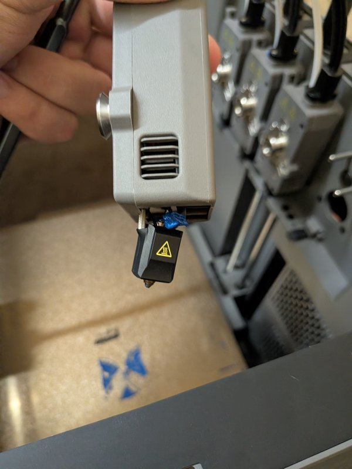

# FlashForge Creator 5 Pro — native toolchanger for Klipper/Mainsail

<a href="https://buymeacoffee.com/monstrofil"></a>

Makes the Creator 5 Pro's 4-tool toolchanger and print lifecycle work for
prints started from Mainsail/Moonraker (e.g. sliced in OrcaSlicer), without
the stock touchscreen app in the loop. Based on reverse-engineering the
stock `firmwareExe` binary (addresses referenced in the source comments),
with some behaviour improved along the way — deliberate divergences are
documented in the file headers.

> **Branch `klipper-vanilla` — not yet run on hardware.** Everything on
> this branch has been exercised against a mock Klipper harness only. The
> `main` branch keeps the previous design, which reads calibration live
> from firmwareExe's JSON and has been used on a real printer. Here all
> per-unit numbers live in ordinary Klipper config, and the touchscreen's
> nozzle-offset calibration is reimplemented as Klipper commands.

## What's in here

| File | Goes to (on the printer) | What it does |
|---|---|---|
| [`klippy-extras/ff_toolchange.py`](klippy-extras/ff_toolchange.py) | `/usr/prog/klipper/klippy/extras/` | The toolchanger: `T0..T3`, dock/grab state machine with sensor polling and retries, per-tool G-code offsets, `TOOLCHANGE_SET_PRINT_OFFSET` (the absolute print-start Z offset), `TOOL_Z_ADJUST` (per-tool persistent babystep), `TOOLCHANGE_STATUS`, `TOOLCHANGE_PARK` |
| [`klippy-extras/ff_tool.py`](klippy-extras/ff_tool.py) | `/usr/prog/klipper/klippy/extras/` | `[ff_tool n]` — one section per tool: hand-written `dock_x`/`dock_y`, autosaved `nozzle_x/y/z` and `z_adjust` |
| [`klippy-extras/ff_tool_offset.py`](klippy-extras/ff_tool_offset.py) | `/usr/prog/klipper/klippy/extras/` | `TOOL_OFFSET_CALIBRATE` / `STATION_CALIBRATE` / `TOOL_OFFSET_STATUS` — the touchscreen's nozzle XY/Z offset calibration, recovered from the binary and reimplemented in Klipper |
| [`klippy-extras/ff_legacy.py`](klippy-extras/ff_legacy.py) | `/usr/prog/klipper/klippy/extras/` | `FF_IMPORT_FIRMWARE_CONFIG` — one-shot import of the factory/touchscreen JSON into Klipper config. Needed once, at install |
| [`config/ff-toolchange.cfg`](config/ff-toolchange.cfg) | `/usr/data/config/` | `[ff_tool 0..3]` dock coordinates (**per unit — ships with the author's numbers**), `[ff_toolchange]` feeds/geometry, `SDCARD_PRINT_FILE` wrapper |
| [`config/ff-tool-offset.cfg`](config/ff-tool-offset.cfg) | `/usr/data/config/` | `[ff_tool_offset]` — probe geometry and guards for the calibration commands |
| [`config/ff-legacy.cfg`](config/ff-legacy.cfg) | `/usr/data/config/` | `[ff_legacy]` — include only for the import step, then remove |
| [`config/ff-print-macros.cfg`](config/ff-print-macros.cfg) | `/usr/data/config/` | `START_PRINT` / `END_PRINT` / `PAUSE` / `RESUME` / `CANCEL_PRINT`, reconstructed from the app's sequences, plus the calibration gate |
| [`orca/`](orca/) | OrcaSlicer printer profile | Machine start/end G-code, change-filament G-code, example project |
| [`docs/notes/`](docs/notes/) | (reference only) | Condensed reverse-engineering notes: what the stock app actually does, with binary addresses |

## ⚠️ Use at your own risk

This is unofficial, reverse-engineered firmware modification. It is not
endorsed by FlashForge, it voids whatever warranty you had, and **you alone
are responsible for what happens to your printer**. Mistakes here are not
hypothetical — a wrong Z offset drives the nozzle through the build plate,
and a failed grab or missing check can end like this:



Read the warnings below, run the Verify section before the first print,
and stay next to the machine until you trust it.

## ⚠️ Before you start

* **The eddy probe's Z home is ~3.2 mm below the real bed plane.** The stock
  app compensates with an absolute `SET_GCODE_OFFSET Z=+3.2xx` at print
  start; `START_PRINT` calls `TOOLCHANGE_SET_PRINT_OFFSET` to do the same.
  Printing without these macros (or with a stale copy of them) drives the
  nozzle into the plate.
* **Where the numbers live.** Nothing is read from firmwareExe's JSON at
  runtime any more. Dock positions (`[ff_tool n] dock_x/dock_y`) and feeds
  (`[ff_toolchange]`) are hand-written in `ff-toolchange.cfg`. Calibrated
  values — `nozzle_x/y/z` per tool, `station_x/y/z`, `z_adjust` — are
  written by the calibration commands (`configfile.set`) and persisted with
  `SAVE_CONFIG` into the `#*#` block at the end of `printer.cfg`, exactly
  like PID or input-shaper results. **Never put those autosaved options
  into an included `.cfg`**: this Klipper fork's `SAVE_CONFIG` refuses with
  "conflicts with included value" and the calibration cannot be saved.
* **Still never edit the JSON under `/usr/data/firmwareRes/config/`.** This
  module no longer reads it, but the touchscreen app still does and rewrites
  those files wholesale — leave it alone.
* **Klipper lives on the firmware partition.** A FlashForge OTA update will
  overwrite `/usr/prog/klipper/`, deleting the extras. Keep this repo and
  re-run step 1 after every firmware update. The `#*#` block in
  `printer.cfg` is on the data partition and survives.

## Install

On the printer (ssh as `pwned` — this assumes a jailbroken printer; how to
get root/ssh access is covered in the community
[Discord](https://discord.gg/tYs3eNEDq)):

```sh
# 1. the klippy extras (firmware partition — may need remount rw)
scp klippy-extras/ff_tool.py klippy-extras/ff_toolchange.py \
    klippy-extras/ff_tool_offset.py klippy-extras/ff_legacy.py \
    pwned@PRINTER:/usr/prog/klipper/klippy/extras/

# 2. the config files (data partition — survives OTA)
scp config/ff-toolchange.cfg config/ff-tool-offset.cfg \
    config/ff-print-macros.cfg config/ff-legacy.cfg \
    pwned@PRINTER:/usr/data/config/
```

3. Append to `/usr/data/config/printer.cfg` (order matters — must come
   AFTER `[virtual_sdcard]` is defined; do **not** put these in
   `printer.override.cfg`, which is included first):

```ini
[include ff-toolchange.cfg]
[include ff-tool-offset.cfg]
[include ff-print-macros.cfg]
[include ff-legacy.cfg]        ; temporary — only for step 5
```

4. `RESTART` (or reboot).

5. Import the factory/touchscreen calibration once:

   ```gcode
   FF_IMPORT_FIRMWARE_CONFIG
   ```

   This reads `extruder.json` / `test.json` / `zoffset.json`, stages the
   nozzle and station values (and any per-tool Z tune) for `SAVE_CONFIG`,
   and prints an `[ff_tool n]` / `[ff_toolchange]` / `[ff_tool_offset]`
   snippet with **your unit's** dock coordinates, feeds and station start
   point. `ff-toolchange.cfg` ships with the author's dock numbers — paste
   the snippet's `dock_x`/`dock_y` into its `[ff_tool 0..3]` sections (and
   any feed that differs into `[ff_toolchange]`) before moving anything.

6. `SAVE_CONFIG` — persists the imported values into `printer.cfg`'s `#*#`
   block and restarts.

7. `TOOLCHANGE_STATUS` and `TOOL_OFFSET_STATUS` — every tool should show a
   nozzle triple and the station `z` must be present; nothing should say
   `NOT CALIBRATED` or "unsaved calibration pending".

8. Remove the `[include ff-legacy.cfg]` line and `RESTART`. The import is
   one-shot; the touchscreen's JSON is not consulted again.

## Verify

Before moving anything:

* `TOOLCHANGE_STATUS` — current tool as derived from the dock sensors, every
  sensor's state, each tool's nozzle position and `z_adjust`, `station_z`,
  dock coordinates and the derived tool-to-tool offsets. Check the
  `dock_x`/`dock_y` rows are your unit's values, not the shipped ones.
* `TOOL_OFFSET_STATUS` — saved calibration per tool and for the station,
  and a warning if anything is staged but not yet `SAVE_CONFIG`'d.
* Physical Z check (clean bed, nothing on it):

  ```gcode
  G28
  T0
  TOOLCHANGE_SET_PRINT_OFFSET NOZZLE=220 BED=80 LAYER=0.25 TOOL=0
  G1 X150 Y150 F6000
  G1 Z0.1 F600
  ```

  The offset command reports a Z around +3.2 with a term-by-term
  breakdown, and the nozzle should end up a paper-thickness above the
  bed at the center. If it presses into the plate instead, STOP — the
  offset is not being applied; do not print until `TOOLCHANGE_STATUS`
  and `TOOL_OFFSET_STATUS` are clean. Afterwards restore the idle state:

  ```gcode
  G1 Z10 F1200
  TOOLCHANGE_PARK
  SET_GCODE_OFFSET X=0 Y=0 Z=0 MOVE=1
  ```

A touchscreen recalibration no longer affects this module. Recalibrate from
Klipper instead (next section), or repeat the import step if you really
want the touchscreen's numbers.

## Calibration

The nozzle XY/Z offset calibration is the touchscreen's own sequence
(`testEddyExtruderOffsetForwardTwoCheck`, recovered from the binary — see
[`docs/notes/45-tool-offset-calibration.md`](docs/notes/45-tool-offset-calibration.md)
and [`46-offset-calibration-recovered.md`](docs/notes/46-offset-calibration-recovered.md)),
constants included. **Take the PEI sheet off first** — the calibration
station sits below the bed plane and the Z probe cannot tell a build plate
from air. Home, then:

```gcode
STATION_CALIBRATE PLATE_REMOVED=1              ; empty carriage, no tool mounted
TOOL_OFFSET_CALIBRATE TOOL=ALL PLATE_REMOVED=1 ; or TOOL=<0..3> for one tool
SAVE_CONFIG
```

`STATION_CALIBRATE` probes the fixed under-bed station with the empty
carriage (eddy frame) and stores `station_x/y/z`; `TOOL_OFFSET_CALIBRATE`
then picks up each tool, touches the station's cylinder in four directions
with the nozzle, fits a circle, repeats the pass centred on that fit and
stores the nozzle's absolute `nozzle_x/y/z`. Results are station-frame
absolutes per tool, so recalibrating one tool leaves the others valid;
`nozzle_z − station_z` is the ~3.2 mm gap the print-start Z offset uses.
Re-run `STATION_CALIBRATE` whenever the station or bed is disturbed.

Per-tool first-layer tuning: Klipper's `SET_GCODE_OFFSET Z_ADJUST=` babystep
is one global number. Use

```gcode
TOOL_Z_ADJUST TOOL=2 ADJUST=-0.02   ; relative, or VALUE=<mm> absolute
SAVE_CONFIG                         ; when you are happy with it
```

instead: it edits `[ff_tool 2] z_adjust`, re-applies immediately if that
tool is mounted, is added on every later grab of that tool, and persists.

## Safety

* **Prints refuse to start while uncalibrated.** `START_PRINT` runs
  `_FF_REQUIRE_CALIBRATION` first, and the Mainsail entry point (the
  `SDCARD_PRINT_FILE` wrapper) checks `printer.ff_toolchange.print_offset_ready`:
  if any tool's `nozzle_z` or the `station_z` is missing, the job is refused
  before anything heats, homes or grabs, with the fix spelled out. Override
  only for bench tests:
  `SET_GCODE_VARIABLE MACRO=_FF_JOB VARIABLE=allow_uncalibrated VALUE=1`.
* **Calibration moves are bounded.** Both calibration commands require
  `PLATE_REMOVED=1`; the Z probe targets −3 by default (the app's own
  station value) and, once a trigger height is known, stops 2 mm below it
  instead of driving on.
* **Implausible results are not saved.** A circle-fit residual above
  0.05 mm, or a nozzle-to-station gap (`nozzle_z − station_z`) outside
  1.5–5 mm, aborts the command with nothing staged. Thresholds are in
  `ff-tool-offset.cfg`.
* A `T<n>` on an unhomed machine aborts instead of homing silently
  (`auto_home: False`) — a remote G28 with a tool mounted rams the nozzle
  into whatever is on the bed.

## OrcaSlicer setup

In the printer profile:

* **Machine start G-code**: contents of
  [`orca/machine-start-gcode.txt`](orca/machine-start-gcode.txt)
* **Machine end G-code**: contents of
  [`orca/machine-end-gcode.txt`](orca/machine-end-gcode.txt)
* **Change filament G-code**: contents of
  [`orca/change-filament-gcode.txt`](orca/change-filament-gcode.txt) —
  `T[next_extruder] ; ff-toolchange`, where the trailing comment is
  load-bearing (see below)

Or skip the copy-pasting: open
[`orca/creator-mainsail.3mf`](orca/creator-mainsail.3mf) in OrcaSlicer —
an example project with the "Mainsail - Flashforge Creator 5 Pro 0.4
nozzle" printer profile already carrying all three G-code blocks above.

Re-slice anything sliced with older start G-code — old files won't call
`TOOLCHANGE_SET_PRINT_OFFSET` and will print ~3.2 mm low.

`START_PRINT` options: `LEVEL=1` probes a fresh mesh (recommended for the
first print), `SOAK=<seconds>` overrides the bed heat soak (default 30,
`SOAK=0` skips; progress is reported in the console).

### Why `T[next_extruder] ; ff-toolchange` and not just `T[next_extruder]`

The comment satisfies two different parsers at once:

* **OrcaSlicer** reads the change-filament block with a real G-code parser.
  It sees an actual `T<n>` command in there, decides the custom G-code
  already changes the tool (`custom_gcode_changes_tool()`), and stops
  emitting its own bare `Tn` after the block — so the tool change happens
  exactly once.
* **FlashForge's Klipper fork** traps toolchange lines *before* they reach
  the G-code interpreter: `virtual_sdcard.py` (line 566) checks
  `line.startswith("T") and line in VALID_GCODE_T`, where `line` comes
  straight from `data.split('\n')` and is **never stripped or normalized**.
  A bare `T2` matches the exact string in `VALID_GCODE_T`, gets swallowed
  by the fork, and is handed to the touchscreen app, which then blocks the
  print on its own `doingChangeEx`/`refuelling` state — state that only the
  touchscreen UI advances. `T2 ; ff-toolchange` is not the exact string
  `T2`, so the trap does not fire; the line falls through to
  `gcode.run_script()`, where `ff_toolchange.py`'s `T2` handler services it.

This is also why touchscreen-started prints are untouched: FF-sliced files
carry bare `Tn` lines, which the fork still intercepts and the app still
services exactly as before. Only lines with the marker comment reach this
module.

## Design notes

* Per-tool offsets are **differences vs a base tool (T0)**, applied on each
  grab the way `CommMgr::setGrabGcodeOffsetMgr` computes them; the
  once-per-print **absolute** Z base (`BuildPage::startPrint`) is set by
  `TOOLCHANGE_SET_PRINT_OFFSET` after the first grab and carried through
  toolchanges. The base-tool term cancels algebraically, so a print may
  start on any tool. Babysteps made mid-print are carried across
  toolchanges, as in the app. Note this split (absolute base at print
  start + differences on grab) is a rewrite of how the original
  `firmwareExe` structures it, kept for fidelity — it would arguably be
  cleaner to apply the absolute offset on the *first toolchange* rather
  than as a `START_PRINT` step, and that change is being considered (see
  Roadmap).
* Calibration is stored the way Klipper's own calibrators store theirs:
  absolute `nozzle_x/y/z` per `[ff_tool n]` section (modelled on
  `[bed_mesh <profile>]` / klipper-toolchanger's `[tool Tn]`) plus
  `[ff_tool_offset] station_x/y/z`, written with `configfile.set()` and
  persisted by `SAVE_CONFIG`. The T0-relative differences are derived at
  load. `[save_variables]` is deliberately not used. The stock touchscreen
  cannot see Klipper-side results — it keeps using its own JSON.
* Everything is a Python extra (not gcode_macro) because the grab sequence
  polls the grab sensor and retries up to 3 times, and the calibration
  drives the fork's `e_stop` probe objects directly — a macro renders its
  whole template before executing and cannot poll.

## Roadmap

Fool-proofing, in rough priority order:

* **Run this branch on hardware.** Calibration sequence, import and the
  safety gates are mock-tested only.
* **Forbid `G28` while a tool is mounted.** Homing Z runs on the eddy
  probe's frame; with a tool in the head the nozzle rams into the plate.
  The module should refuse (or auto-park first) instead of trusting the
  operator.
* **Z-height / clearance check after picking a tool**, before leaving the
  dock area — catch a bad grab early instead of dragging or breaking the
  tool on the way out.
* **Move the absolute print Z offset from `START_PRINT` to the first
  toolchange of a job**, removing the ordering dependency between the
  macro and the slicer's start G-code.
* **Block the stock touchscreen UI during Mainsail prints.** The app
  doesn't know a print is running (it only tracks jobs it started
  itself), so the screen stays fully live — a stray tap can home, move
  the carriage, start a filament load, or fire its own toolchange into
  the middle of a running job. The module should lock the UI out (or at
  least its motion commands) while a Mainsail-started print is active.

## Reverse-engineering notes

Condensed notes from the `firmwareExe` analysis — recovered sequences, binary
addresses, JSON semantics — live in [`docs/notes/`](docs/notes/):
architecture overview, the Klipper-fork delta (including the `Tn` interception),
the verified grab/release sequences, the offset model, the recovered
nozzle-offset calibration and its Klipper port, and the full print
lifecycle with the deliberate divergences listed.

## Support

If this saved your build plate (or your sanity), you can
[buy me a ~~coffee~~ new hotend](https://buymeacoffee.com/monstrofil).
