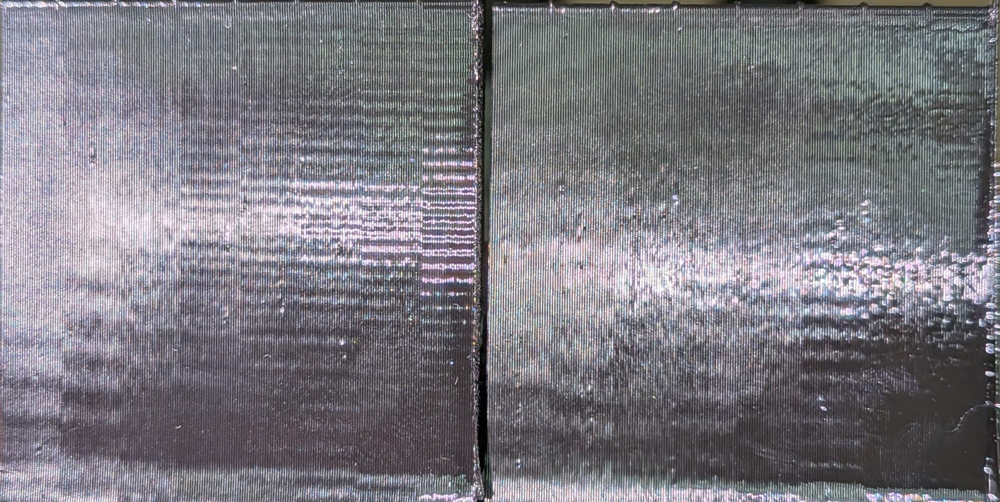

# VFA calibration

VFA means **vertical fine artifacts**: fine vertical banding caused by a
stepper motor’s torque ripple. It is different from input shaping. Your
printer already has factory VFA values, so recalibrate only after replacing a
motor or when visible banding remains after normal tuning.

## Before you start

- Make sure no print is running.
- Remove the build plate.
- Make sure the printer is homed and the carriage can move freely.
- Leave the toolchanger empty; Reforge mounts a tool automatically for the
  measurement.

## Run the calibration

Send these commands from the Mainsail Console, one at a time:

```gcode
STEPPER_RESONANCE_FACTORY_CALIBRATE
SAVE_CONFIG
```

The first command measures the X and Y motors. The printer will move quickly
and make a noticeable vibration noise while it searches. Wait for it to
finish before sending `SAVE_CONFIG`.

`SAVE_CONFIG` is required: the first command applies the correction for the
current session and stages the values, while `SAVE_CONFIG` writes them to the
configuration for future restarts. It also restarts Klipper.

## Afterward

Wait for Klipper to reconnect, then run:

```gcode
STATUS
```

The VFA correction is applied by the printer’s motor drivers on subsequent
moves. It is independent of `SHAPER_CALIBRATE` and does not replace input
shaping.

## Example

This comparison shows the same speed sweep with VFA compensation disabled on the left and
enabled on the right. Speeds run from **80 to 200 mm/s, right to left**. The
enabled side has visibly cleaner vertical walls and fewer fine bands.



*VFA disabled (left) versus enabled (right). 